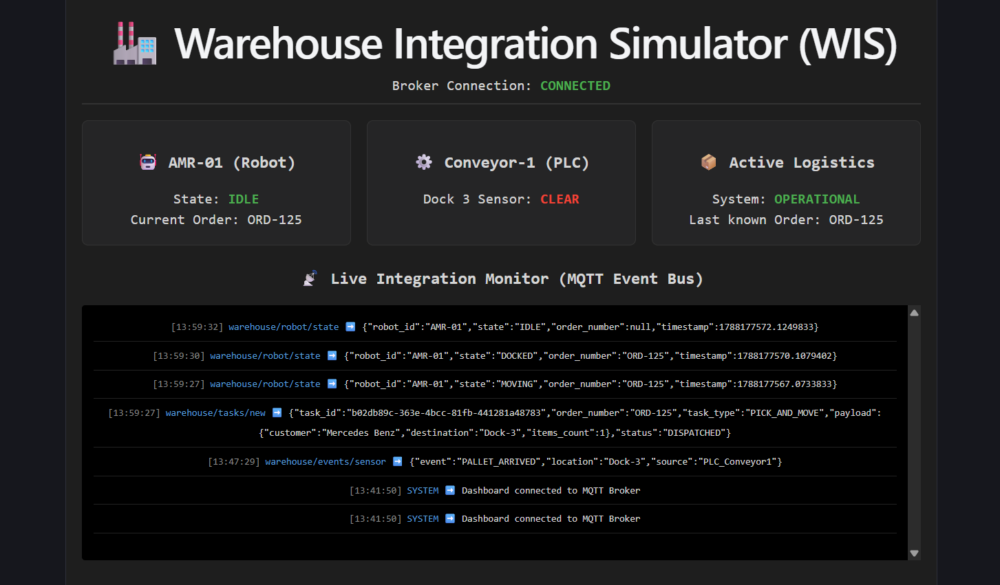
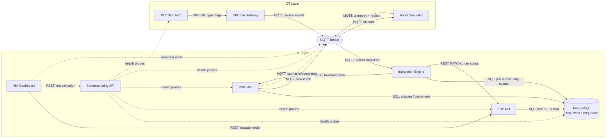

# Warehouse Integration Simulator

_A local warehouse integration simulator for ERP, WMS, MQTT, PLC, robot, and HMI workflow testing._

[](docker-compose.yml) [](services/erp-api/) [](frontend/react-dashboard/) [](database/) [](services/mqtt-broker/)



This project is a local simulation of a warehouse integration architecture connecting an ERP, a WMS, a message broker, warehouse automation services, and operator-facing user interfaces. It is intended to model the movement of orders from business systems into physical execution flows, including queueing, task dispatch, and completion feedback.

The repository is organized as a small multi-service Docker application. The code is focused on demonstrating integration patterns rather than production deployment readiness.

## Overview

The system includes:

- an ERP API for creating and tracking orders
- a WMS API for inventory allocation and task processing
- an integration engine that polls pending events and forwards them
- an MQTT broker for asynchronous messaging
- a PLC simulator and OPC UA gateway
- a robot simulator that moves through warehouse states
- a React dashboard for operator monitoring and order dispatch
- a realistic HMI for 2D/3D floor visualization, order dispatch and telemetry
- PostgreSQL schemas for ERP, WMS, and integration data

The project is designed to show how services communicate across bounded contexts using explicit interfaces such as REST and MQTT.

## Technical Documentation

Use the [documentation index](docs/README.md) for architecture notes, implementation history, acceptance documents, ADRs, and reusable implementation-note templates. The [project engineering log](docs/PROJECT-LOG.md) is the append-only record of ongoing changes and validation results.

## Demo Media

The repository includes current visual assets that can be used in the README or linked from release notes.

### HMI Dashboard Screenshot

This is the top-level operator view: a compact command surface for dispatch, live MQTT status, robot state, and commissioning checks.


### Commissioning Mode Demo

This clip shows the site-validation flow, focusing on readiness checks, diagnostics, and the operational confidence loop before release.

<video src="assets/commissioning-mode-demo.mp4" controls width="100%"></video>

### 2D Initial Demo

This clip shows the warehouse as a live floor map, with robot movement, dock activity, and telemetry updates unfolding in real time.

<video src="assets/2D-initial-demo.mp4" controls width="100%"></video>

### 3D Initial Demo

This clip shows the immersive twin view, where the same operations gain depth, spatial context, and a more cinematic sense of scale.

<video src="assets/3D-initial-demo.mp4" controls width="100%"></video>

The screenshot works best as the quick at-a-glance entry point, while the videos provide the richer operational story for each mode.

These visuals reflect the current tagged release state of the project. The simulator is still under active development, so the presentation, interactions, and overall quality will continue to be refined in upcoming releases.

## Architecture



## Service responsibilities

### ERP API

The ERP service owns the business order lifecycle. It creates orders, persists their state, and records outbound integration events.

Relevant code:

- `services/erp-api/app/main.py`
- `services/erp-api/app/models.py`

### WMS API

The WMS service handles inventory and task allocation. It receives translated ERP tasks, validates capacity, and emits task-related status updates.

Relevant code:

- `services/wms-api/app/main.py`
- `services/wms-api/app/models.py`

### Integration Engine

The integration engine is the orchestration layer between ERP and WMS. It polls pending records from the integration event table, processes them, and sends follow-up updates to the downstream services.

Relevant code:

- `services/integration-engine/worker.py`

### MQTT Broker

The broker provides asynchronous messaging between services and the UI. It is also used for telemetry and task completion callbacks.

Relevant config:

- `services/mqtt-broker/mosquitto.conf`

### OPC UA PLC Simulator and Gateway

The PLC simulator provides industrial-style tag data, and the gateway translates these device events into MQTT traffic for the rest of the system.

Relevant code:

- `services/opcua-plc-simulator/server.py`
- `services/opcua-gateway/gateway.py`

### Robot Simulator

The robot simulator follows a state machine such as IDLE, MOVING, and DOCKED. It emits telemetry and completion events back into the integration flow.

Relevant code:

- `services/robot-simulator/worker.py`

### Frontends

The repository keeps two active user interfaces on `main`:

- `frontend/react-dashboard` for operator monitoring, order dispatch, and live integration logs
- `frontend/realistic-wis-hmi` for the richer warehouse floor visualization and telemetry view

The earlier `frontend/digital-twin` and `frontend/wis-digital-Twin-v2` frontends are being retired/archived so the branch stays focused and easier to merge.

## Repository structure

```text
warehouse-integration-simulator/
├── database/
│   ├── 01_schemas.sql
│   ├── 02_erp_schema.sql
│   ├── 03_wms_schema.sql
│   ├── 04_integration_schema.sql
│   └── 05_seed_data.sql
├── docs/
│   ├── README.md
│   ├── PROJECT-LOG.md
│   ├── templates/
│   └── adr/
├── frontend/
│   ├── react-dashboard/
│   └── realistic-wis-hmi/
├── services/
│   ├── erp-api/
│   ├── integration-engine/
│   ├── mqtt-broker/
│   ├── opcua-gateway/
│   ├── opcua-plc-simulator/
│   ├── robot-simulator/
│   └── wms-api/
├── docker-compose.yml
├── README.md
└── .env.example
```

## Database design

The project uses PostgreSQL with separate schemas:

- `erp` for ERP data
- `wms` for warehouse inventory and tasks
- `integration` for outbox-style integration events

The integration schema includes an `integration_events` table used as the outbox. The structure is defined in `database/04_integration_schema.sql`.

## Transactional outbox pattern

This project implements the transactional outbox pattern in a simplified form.

The flow is:

1. The ERP writes the business record and the integration event in the same database transaction.
2. The integration event is stored with a `PENDING` status.
3. A worker polls the `integration_events` table.
4. The worker processes the event and updates status to `PROCESSED` or `FAILED`.
5. Downstream systems are triggered after the database write succeeds.

This pattern prevents the "business commit succeeds but message dispatch is lost" problem without requiring a distributed two-phase commit.

The relevant implementation is:

- `services/erp-api/app/main.py` — creates the order and logs the event in the same transaction
- `database/04_integration_schema.sql` — defines the outbox table
- `services/integration-engine/worker.py` — polls pending events and handles processing

## Typical workflow

A normal order flow looks like this:

1. A request is sent to the ERP API to create an order.
2. The ERP creates the order and logs an `ORDER_CREATED` event as `PENDING`.
3. The integration engine reads the row from `integration_events`.
4. The engine translates the ERP payload into the WMS task format.
5. The WMS validates the request and allocates inventory.
6. The WMS emits task or completion events over MQTT.
7. The robot simulator executes the assigned task and reports status.
8. The integration layer updates the ERP order status based on completion events.

## Prerequisites

This project expects the following on the local machine:

- Docker and Docker Compose
- Node.js and npm for the frontend dashboard
- Python for the service code and local development if needed

## Quick start

From the project root:

```bash
docker compose up -d --build
```

Then, for the operator dashboard:

```bash
cd frontend/react-dashboard
npm install
npm run dev
```

The dashboard is typically served on a local Vite port, such as `http://localhost:5173` depending on your local configuration.

For the realistic HMI view:

```bash
cd frontend/realistic-wis-hmi
npm install
npm run dev
```

To run the end-to-end order-flow tests, start the Docker stack first and run:

```bash
make e2e
```

The test creates a uniquely named ERP order and waits for it to reach `COMPLETED`. This exercises the ERP API, transactional outbox, integration engine, WMS allocation, MQTT task dispatch, robot simulator, WMS completion handler, and ERP status callback. The default timeout is 90 seconds and can be changed with `E2E_TIMEOUT_SECONDS`.

## Environment configuration

The repository includes an `.env.example` file. Copy it to `.env` and fill in the required values for your local environment before starting the stack.

```bash
cp .env.example .env
```

## Current status

The repository is currently in an active development state. The core flow is implemented and the services are connected through Docker and message flow. The main areas in place include:

- ERP order creation
- WMS allocation logic
- integration event polling
- MQTT communication
- robot state simulation
- warehouse visualization in the frontend

The project is not presented as a production-ready system; it is an environment for experimenting with warehouse integration patterns.

## Known gaps / limitations

This project is intentionally simplified. Some areas that are still limited or incomplete include:

- retry logic and resilience patterns
- more complete error handling in service-to-service calls
- broader observability and metrics
- production-grade deployment practices
- more realistic warehouse inventory and routing logic
- an authoritative simulation clock that can pause, resume, or step every backend process in lockstep
- full historical replay that can reconstruct a completed run from ordered simulation events and ticks

The current `services/simulation-control/manager.py` service is a lightweight control plane for simulation state, not a global time source. Robots, the PLC simulator, and integration workers still advance on their own loops, so the simulation remains operationally useful but not yet deterministic in the replayable sense described above.

## Development notes

This project is useful for understanding how several industrial and enterprise patterns interact in one local system:

- bounded context ownership
- event-driven communication
- asynchronous integration via broker transport
- outbox-based reliable messaging
- cross-service workflow orchestration
- OT/IT separation in warehouse automation

## License

This repository does not currently declare a license in the project root. Check the repository state before reusing it in a public or production environment.

## Notes

This project is best treated as a working simulation and architecture example rather than a turnkey production platform. The value is in the patterns, the service boundaries, and the code flow between business and operational systems.
