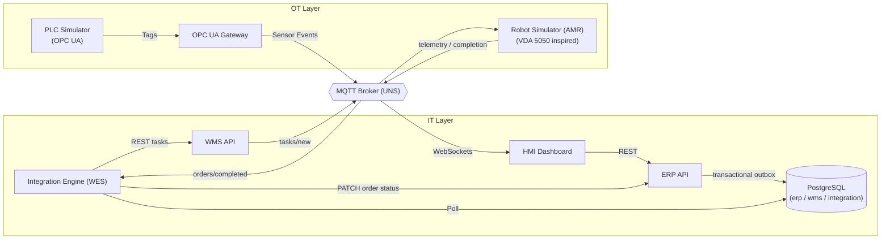

# Warehouse Integration Simulator (WIS)

**A production-inspired warehouse automation platform simulating how ERP systems, WMS, PLCs, and robots communicate through an event-driven, IT/OT-converged architecture.**

         

> 💡 **Built for Industrial Systems Engineering:** Implements strict IT/OT separation, VDA 5050 fleet execution over MQTT, OPC UA hardware tag subscriptions, and domain-driven microservices.

  

*The live HMI: command center, OT telemetry, and the MQTT integration monitor.* 

---

## Why I'm Building This

Most warehouse projects stop at simple CRUD stock tracking. WIS focuses on the distributed systems engineering required to run an automated floor.

Warehouse Integration Simulator (WIS) explores the engineering behind real intralogistics systems: asynchronous communication, industrial protocols, robotics coordination, and systems integration.

Rather than focusing on a single application, WIS simulates how multiple independent systems collaborate inside an automated warehouse; from order creation in an ERP, through allocation in a WMS, to execution by robots and PLC-controlled equipment, and back again through confirmation events that close the loop.

This project is built in public from an engineering perspective: the architecture, decisions, trade-offs, and progress are documented openly in this repository.

---

## System Architecture



This mirrors the real IT/OT separation used in industrial environments: ERP and WMS live in IT; PLCs, conveyors, and robots live in OT; an integration layer connects them through REST, OPC UA, and MQTT.

---

## Core Components

| Component            | Responsibility |
| -------------------- | -------------- |
| ERP Service          | Order management & business operations (source of business truth) |
| WMS Service          | Inventory, locations, stock allocation, task confirmation & stock movement |
| Integration Engine   | Event orchestration & translation between bounded contexts (ERP ↔ WMS) |
| MQTT Broker          | Asynchronous message transport (pub/sub + WebSocket bridge) |
| PLC Simulator        | Industrial device communication using OPC UA (strongly-typed tags, subscriptions) |
| OPC UA Gateway       | Bridges OT tag changes into the MQTT event bus |
| Robot Simulator      | Warehouse task execution via a physical state machine (IDLE → MOVING → DOCKED) |
| HMI Dashboard        | Operator monitoring & command center (event-driven UI over MQTT WebSockets) |
| PostgreSQL           | Service-owned data in three bounded-context schemas: `erp`, `wms`, `integration` |

---

## Guiding Principles

- Event-driven communication
- Service-owned data (bounded contexts): each service touches only its own schema; no cross-service table access
- Loosely coupled architecture; systems communicate only through explicit contracts (REST / MQTT)
- Industrial communication via OPC UA
- Observability as a first-class concern (integration event log + correlation IDs across every hop)
- Fail-fast, environment-driven configuration (no secrets in code)
- Documented decisions (ADRs) over tribal knowledge

---

## Technology Stack

| Layer               | Technology |
| ------------------- | ---------- |
| Backend             | FastAPI (Python) |
| Frontend            | React (Vite) |
| Database            | PostgreSQL (JSONB, UUID, multi-schema) |
| Messaging           | MQTT (Mosquitto, QoS 1, WebSockets) |
| Industrial Protocol | OPC UA (asyncua) |
| Infrastructure      | Docker & Docker Compose |
| API Contract        | OpenAPI / Swagger (auto-generated) |

---

## Current Features

- **ERP order creation** over REST with strict Pydantic validation and OpenAPI docs
- **Interactive warehouse HMI**: live MQTT monitor + Command Center that dispatches real orders
- **Closed-loop execution**: allocation → dispatch → physical execution → confirmation → inventory decrement → order completion
- **Transactional outbox** in the ERP, polled by the Integration Engine (reliable messaging without two-phase commit)
- **Correlation IDs** propagated across ERP → Integration → WMS → MQTT → Robot telemetry
- **OPC UA PLC simulator** with strongly-typed tags (`Running`, `Speed`, `Sensor_Dock3`) and data-change subscriptions
- **OPC UA → MQTT gateway** bridging OT events into the IT event bus
- **Robot state machine** with real-time telemetry feedback
- **Modular microservice architecture**: independently deployable services, one Docker network
- **Environment-driven, fail-fast configuration** (`.env` + `.env.example`, no baked-in secrets)

---

## Development Roadmap

### Phase 1 — Core Platform ✅
- [x] ERP Service
- [x] Interactive HMI Dashboard
- [x] REST API Integration
- [x] MQTT Event Bus
- [x] PostgreSQL persistence refinement (bounded-context schemas, seed data)

### Phase 2 — Industrial Integration ✅
- [x] PLC Simulator (OPC UA)
- [x] Robot State Machine
- [x] Conveyor & sensor simulation
- [x] OPC UA → MQTT gateway
- [ ] Device health monitoring (Commissioning Mode)

### Phase 3 — Warehouse Execution ✅
- [x] Task Dispatch Engine (Integration Engine + WMS allocation)
- [x] Inventory Movement Simulation (stock decrement on confirmation)
- [x] Robot Acknowledgement Workflow (completion receipts)
- [ ] Error recovery scenarios (reconnection, retry, backoff)

### Phase 4 — Production Readiness 🚧
- [ ] Commissioning Mode + FAT/SAT test documentation
- [ ] Event-replay drawer & digital-twin warehouse map
- [ ] Structured logging & metrics
- [ ] Integration / contract testing
- [x] Docker deployment (Compose)
- [ ] CI/CD pipeline
- [ ] Version 1.0 release + 30-second demo video

---

## Engineering Decisions

This project intentionally models how enterprise warehouse software is designed rather than how traditional monolithic applications are built. See `docs/adr/` for the full record. The Integration Engine acts as a lightweight WES (Warehouse Execution System) layer, orchestrating business tasks from the WMS and translating them into physical execution commands for the OT/MQTT layer.

### Why Event-Driven?
Warehouse equipment operates asynchronously. An ERP should not directly control PLCs or robots, it publishes business facts; the OT layer reacts.

### Why a Transactional Outbox?
The ERP writes the order **and** the integration event in one DB transaction. The Integration Engine polls and forwards it. No event is ever lost if the broker is down, and no two-phase commit is needed.

### The Closed Loop (An example workflow)

```
ERP ──(outbox)──▶ Integration Engine ──▶ WMS (allocates stock)
 ▲                                            │  MQTT: tasks/new
 │                                            ▼
 └── ERP order COMPLETED ◀── WMS decrements ◀─ Robot executes & confirms
```

1. ERP creates the order and logs a `PENDING` integration event (with correlation ID).
2. Integration Engine translates ERP language → WMS language and calls the WMS API.
3. WMS **allocates** inventory (rejects with 409 if stock is insufficient) and dispatches the task over MQTT.
4. The robot executes its state machine and publishes a completion receipt.
5. WMS marks the task `COMPLETED`, decrements inventory, and publishes `orders/completed`.
6. The Integration Engine patches the ERP order to `COMPLETED`. The loop is closed.

---

## Real-World & Industry Standards Alignment

WIS is designed explicitly around production intralogistics standards:

- **ANSI/ISA-95 (Enterprise-Control System Integration):** Architected according to ISA-95 principles, separating enterprise/IT business workflows (ERP/WMS) from OT operational/physical execution (PLCs/Robots).
- **VDA 5050 (AGV/AMR Fleet Protocol):** Task assignment, state machine reporting (`IDLE` → `MOVING` → `DOCKED`), and live telemetry topics inspired by VDA 5050 MQTT messaging concepts.
- **Unified Namespace (UNS):** Uses MQTT as a centralized, decoupled state bus rather than legacy point-to-point polling links.
- **OPC UA Gateway Pattern:** Emulates real edge computing where raw hardware tags (IEC 62541) are bridged into structured JSON events for high-level software consumption.
- **Reliable Messaging (Transactional Outbox):** Implements enterprise Change Data Capture (CDC) principles to prevent dropped events between database writes and broker dispatch.

---

## Repository Structure

```text
warehouse-integration-simulator/
│
├── services/
│   ├── erp-api/               # FastAPI: orders, validation, outbox
│   ├── wms-api/               # FastAPI: allocation, confirmation, stock movement
│   ├── integration-engine/    # Outbox poller + translator + completion handler
│   ├── opcua-plc-simulator/   # asyncua OPC UA server (conveyor tags)
│   ├── opcua-gateway/         # OPC UA subscription → MQTT bridge
│   ├── robot-simulator/       # AMR state machine + telemetry
│   └── mqtt-broker/           # Mosquitto config (TCP + WebSockets)
│
├── frontend/
│   └── react-dashboard/       # HMI: monitor + command center
│
├── database/                  # Schema DDL + seed data (erp / wms / integration)
├── docs/
│   ├── adr/                   # Architecture Decision Records
│   └── architecture.md
├── assets/                    # Screenshots & demo media
├── docker-compose.yml
├── .env.example
└── README.md
```

---

## Quick Start

```bash
git clone https://github.com/HopeyCodeDS/warehouse-integration-simulator
cd warehouse-integration-simulator
cp .env.example .env          # fill in local values
docker compose up -d --build  # boots DB, ERP, WMS, engine, PLC, gateway, robot, broker

cd frontend/react-dashboard
npm install && npm run dev    # HMI at http://localhost:5173
```

Dispatch an order from the HMI Command Center and watch the full IT/OT loop execute live in the Integration Monitor.

---

## Project Status

| Area                | Status |
| ------------------- | ------ |
| ERP                 | ✅ Active |
| WMS                 | ✅ Active |
| Integration Engine  | ✅ Active |
| HMI Dashboard       | ✅ Active |
| MQTT                | ✅ Active |
| PLC Simulator       | ✅ Active |
| Robot Dispatch      | ✅ Active |
| Observability       | 🚧 Correlation IDs live; commissioning panel next |

---

## Key Engineering Challenges

| Challenge | Solution |
|-----------|----------|
| Reliable ERP → WMS messaging | Transactional Outbox |
| End-to-end traceability | Correlation IDs |
| Hardware event ingestion | OPC UA subscriptions |
| Decoupled system communication | MQTT pub/sub |
| Inventory consistency | Closed-loop confirmation workflow |

---

## Future Horizon — Bounded AI Supervisor (Research Track) 🧪

A bounded AI execution layer designed to augment — never replace — deterministic warehouse control. Every AI decision remains constrained by explicit operational safety rules.

- [ ] **Deterministic Safety Envelope**  
      Rule-based validation engine that intercepts every AI-generated routing or task proposal before execution. AI can recommend; only validated actions are dispatched.

- [ ] **AI Optimization Agent**  
      Reinforcement Learning / LLM-assisted supervisor that optimizes task prioritization, congestion avoidance, and fleet utilization without directly controlling hardware.

- [ ] **State Divergence & Fallback Engine**  
      Continuously compares predicted warehouse state against live OPC UA and MQTT telemetry. When divergence exceeds defined thresholds, control automatically falls back to deterministic heuristic scheduling.

> **Design Principle:** The AI Supervisor never issues direct PLC or robot commands. It produces optimization proposals that must pass deterministic validation before entering the operational event bus.
---

## Building in Public

I document the engineering journey through this repository and on LinkedIn, including:

- Architecture diagrams & ADRs
- System design trade-offs
- HMI demonstrations & warehouse workflow simulations
- Real debugging war stories (OPC UA, MQTT, distributed systems)
- Public roadmap and milestone tracking via GitHub Projects

**v1.0 target:** Commissioning Mode, FAT/SAT, CI/CD, and a 30-second cinematic demo.

---

## Author

**Opeyemi Momodu**  
AI Software Engineer • Systems Integration • Warehouse Automation • Event-Driven Architecture

Building software where enterprise systems, industrial automation, and AI intersect.